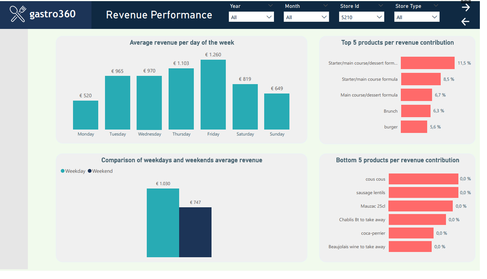

# Gastro 360 – Restaurant Analytics Tool (Paris)

## 📊 Summary

**Gastro 360** is an analytics tool designed for **restaurant owners and operations managers in Paris**. This project is part of the Group Project during our Data Analytics Bootcamp at Le Wagon, held from November 2024 - February 2025. Our goal is to help business partners scale their operations, increase revenue streams, and optimize workflows using insightful data dashboards developed in Power BI.

This project addresses a key gap in the Tiller by SumUp ecosystem—while Tiller provides a powerful POS system, it lacks a robust analytics solution. Our tool leverages Tiller’s dataset to provide actionable insights for business growth.

---

## 🎯 Project Goal

To build **interactive dashboards** for restaurant owners and operations managers that provide a **360° view of their business performance**. These dashboards visualize key KPIs (both global and operational), enabling data-driven decisions.

---

## 👤 Target Users

- Restaurant Owners  
- Operations Managers

---

## ❓ Business Questions We Aim to Answer

1. **Revenue Optimization**  
   - When are the peak sales periods?  
   - Which high-performing items can be promoted to boost revenue?

2. **Performance Optimization**  
   - What are the top 5 best-selling products?  
   - Which days or time slots see the highest demand?  
   - How does location influence performance?

3. **Sales Forecasting**  
   - Can we predict seasonal or time-specific demand fluctuations?  
   - Which models can be used to anticipate future sales?

4. **Customer Behavior Analysis**  
   - What promotions or personalized recommendations would boost customer satisfaction and sales?

---

## 🛠 Tech Stack

- **BigQuery / SQL** – for data warehousing and querying  
- **Python (Google Colab)** – for data cleaning, exploration, and modeling  
- **Power BI** – for creating interactive dashboards and visualizations  
- **GitHub** – version control and collaboration  
- **Notion** – for team documentation and planning

--

## 📦 Dataset Context

The dataset is sourced from **Tiller by SumUp**, a leading POS solution in France. It includes a substantial number of restaurant orders from across Paris—an uncommon and rich dataset for business intelligence projects.

Tiller is transitioning to a more data-driven approach and seeks tools that empower its clients with powerful analytics. **Gastro 360 is designed to fill that gap.**

---

## 🚀 Outcomes

The objective of this project is to empower restaurant owners and managers to:

- Monitor key performance indicators (KPIs) in real time

- Identify trends and uncover opportunities for upselling

- Gain a deeper understanding of customer behavior

- Explore market insights, including location-based and restaurant-level performance

- Accurately forecast demand and optimize resource planning

- Make data-driven operational and strategic decisions

---
## 📸 Power BI Report Preview

Here’s a visual walkthrough of the dashboard pages from my Power BI report:

---

### 📊 Page 1

---

### 📊 Page 2

---

### 📊 Page 3

---

### 📊 Page 4

---

### 📊 Page 5

---

### 📊 Page 6

## 📊 Power BI Report in PDF: Restaurant BI

📄 [Click here to view the full Power BI report (PDF)](https://github.com/Aklilu8734/Paris-Restaurant-Analytics-/raw/main/Portfolio__Restaurant_Insights.pdf)

